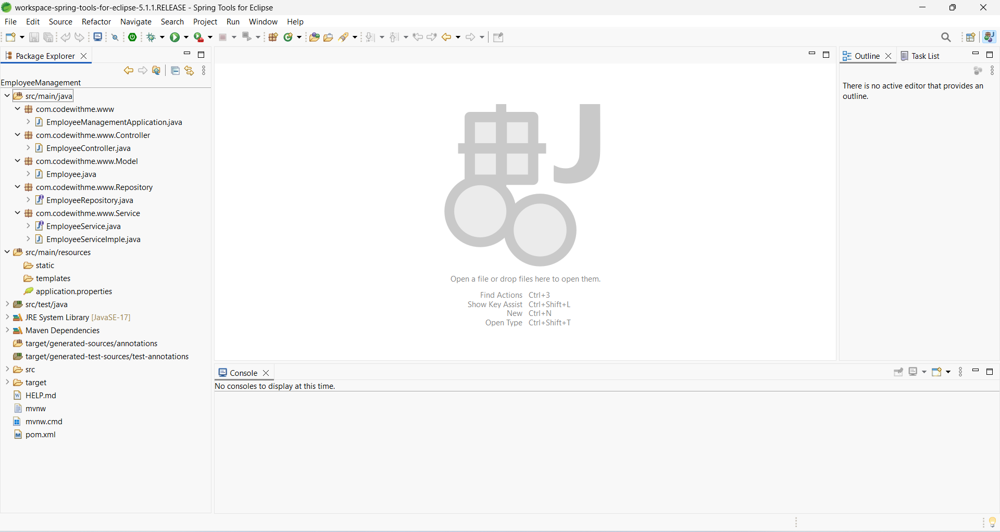
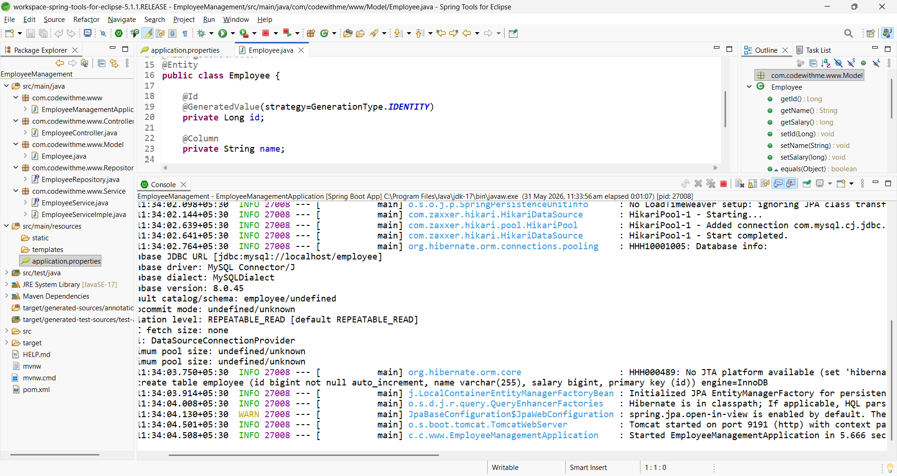
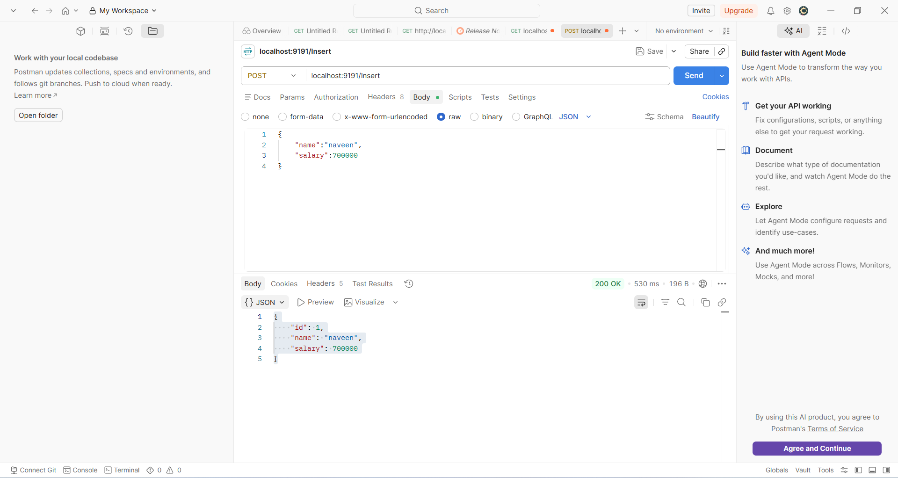
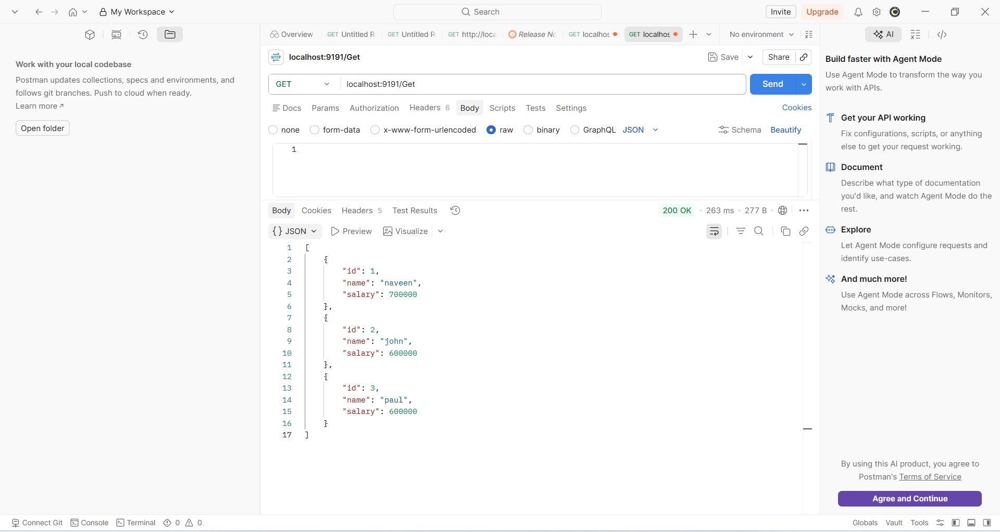
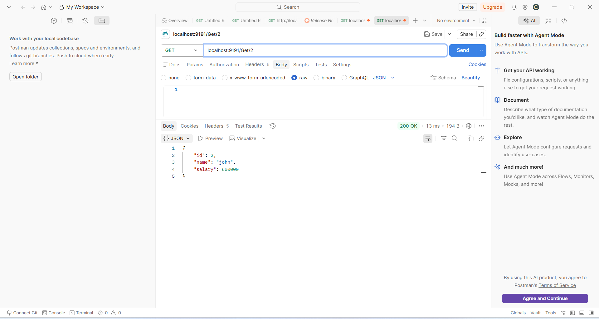
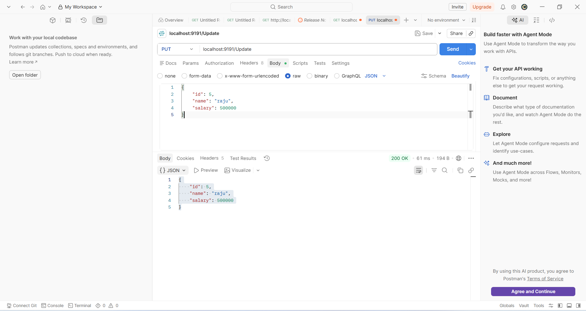
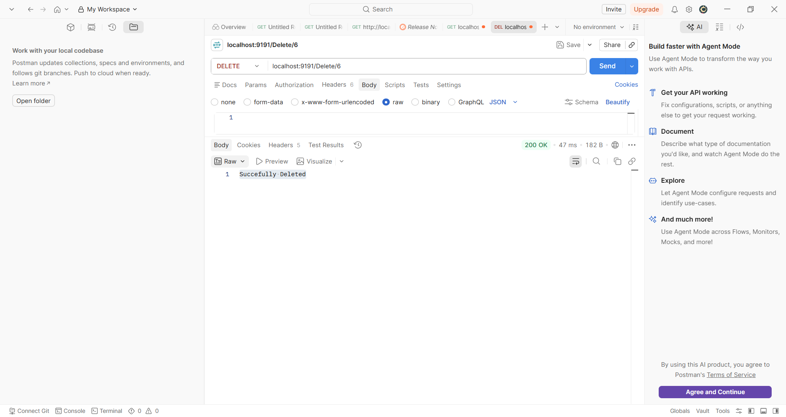
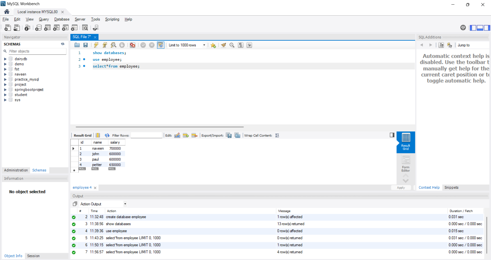

# Employee Management REST API

## Project Description
This is a Spring Boot CRUD REST API project for managing employee data using MySQL database.

## Technologies Used
- Java
- Spring Boot
- Spring Data JPA
- MySQL
- Lombok
- Maven
- PostMan

## Features
- Add Employee
- Get All Employees
- Get Employee By ID
- Update Employee
- Delete Employee

## Project Structure

## Application Running

## Insert Employee API

## Get All Employees API

## Get Employee By ID API

## Update Employee API

## Delete Employee API

## MySQL Database

## How To Run
1. Clone the repository
2. Open project in STS/Eclipse
3. Configure MySQL in application.properties
4. Run Spring Boot application
5. Test APIs using Postman

## Author
Naveen

## Connect With Me

- LinkedIn: https://www.linkedin.com/in/naveenbattina
- GitHub: https://github.com/Naveen93910

